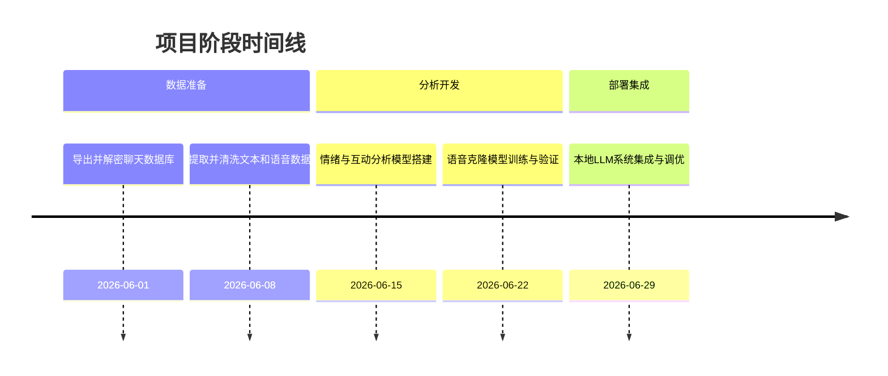
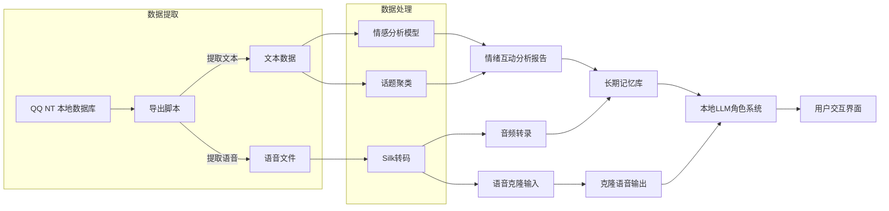

# 执行摘要  
本方案从 QQ NT（9.9.29 Windows 版）本地数据库导出入手，依次完成数据提取、文本及语音清洗、情感与互动分析、语音克隆训练、以及本地大模型集成。首先定位并解密 QQ 本地 SQLite 数据库（通常位于 `C:\Users\<用户名>\Documents\Tencent Files\<QQ号>\nt_qq\nt_db`），使用 SQLCipher 或 DB Browser 解除加密并提取聊天记录【15†L93-L100】【10†L72-L82】。然后将对话文本通过编程解析清洗，语音消息提取并利用开源工具（如 silk-v3-decoder）转为常用音频格式【20†L12-L16】。在此基础上，对双方对话文本应用情感分析和话题模型，绘制情绪随时间变化的时间线图；分析轮次模式、情绪传递等互动指标。接着选用 Coqui XTTS、OpenVoice、或 RVC 等开源语音克隆方案，通过少量样本生成个性化语音模型【30†L18-L21】【34†L20-L28】。最后部署在用户硬件（Ryzen 7 7735H + RTX4060 4GB）上的本地 LLM 系统（如量化后的 Llama3/Qwen2.5 7B、ChatGLM等），结合向量数据库（Chroma/FAISS）实现角色化对话与知识检索。整个流程附带失败备选方案，并配以时间表与资源估算。  



## 1. 定位并导出 NTQQ 本地数据库  
- **查找数据库文件**：QQ NT 的聊天记录保存在本地 SQLite 数据库中。Windows 上一般位于 `C:\Users\<用户名>\Documents\Tencent Files\<QQ号>\nt_qq\nt_db` 目录【15†L93-L100】（也可能在 `%AppData%\Tencent\QQ\Local Storage\` 等路径）。常见文件如 `nt_msg.db`、`c2c_msg.db` 记录了私聊消息；还有 `buddy_msg_fts.db`、`group_msg.db` 等。  
- **解除加密**：NTQQ 数据库采用 SQLCipher 加密，需获取密钥并解密。可以使用动态调试（如 [Myth 的博客](https://myth.cx/p/qq-nt-db/)）从 `wrapper.node` 中提取密钥，然后在 DB Browser for SQLite 中导入：打开“工具→设置加密”，留空密码后点击“确定”，即可解密打开【10†L72-L82】。也可借助 [qq-win-db-key 项目](https://github.com/QQBackup/qq-win-db-key)或第三方脚本导出。注意先备份数据库文件。  
- **去除头部**：NTQQ数据库文件前1024字节为明文头，需要删除才能使用 SQLCipher 读取【15†L98-L104】。例如：  
  ```bash
  cat nt_msg.db | tail -c +1025 > nt_msg.clean.db
  ```  
- **使用 SQLCipher 导出**：在 SQLCipher 命令行中执行：  
  ```sql
  .open nt_msg.clean.db
  PRAGMA key = '密钥'; PRAGMA kdf_iter = 4000;
  ATTACH DATABASE 'nt_msg_decrypt.db' AS plain KEY '';
  SELECT sqlcipher_export('plain'); DETACH DATABASE plain;
  .exit
  ```  
  如出现“database disk image is malformed”错误，可先导出 SQL 文本后重新导入【15†L130-L139】。解密后得到纯 SQLite 数据库 `nt_msg_decrypt.db`。  

## 2. 数据提取与清洗  
- **文本提取**：使用 SQLite 工具或 Python 脚本从解密后的数据库导出文本记录。例如 `c2c_msg_table` 表（个人聊天）中，字段 40050/40058 为发送时间戳，40093 为发送者昵称，40800 为消息内容（存储为 Protobuf 二进制【10†L74-L82】）。可通过查询导出纯文本，对 Protobuf 内容采用 [CyberChef](https://gchq.github.io/CyberChef/) 等工具解析。确保过滤系统消息、空消息等冗余内容。  
- **语音提取**：语音消息通常以 Silk v3 编码（文件扩展 `.slk`）保存【20†L12-L16】。这些文件存放在 QQ 的媒体缓存目录（例如 nt_data 下的 Audio 文件夹）。将所有 `.slk` 文件复制出来后，使用 [silk-v3-decoder](https://gitcode.com/gh_mirrors/si/silk-v3-decoder) 或 Silk 转码工具批量转换为 WAV/MP3【20†L12-L16】。例如命令行：  
  ```bash
  silk2mp3.exe input.slk output.wav
  ```  
  或使用提供的脚本：`sh converter.sh <输入文件夹> <输出文件夹> mp3`【20†L61-L68】【42†L7-L16】。转码后可保留原始音频和转写文本。  
- **图片文件（可选）**：若需要分析表情包或图片，可提取 nt_data 下的图片文件，进行 OCR 或图像分析。考虑到主要任务为文本与语音，这里可暂略或留作后续扩展。  

## 3. 情绪与互动分析  
- **情感分析模型**：对聊天文本使用中文情绪分类模型（如百度 ERNIE、腾讯 SKEP、RoBERTa 变体或 PaddleHub 提供的 OCEMOTION 模型）进行标注。可分类为正面/负面/中性，或细粒度情绪类别。通过时间序列可视化每个参与者的情感轨迹，构建情绪随聊天进展的时间线图。  
- **互动模式分析**：统计对话轮次、话轮时长、发言频率等指标，分析谁主导对话、话题切换频率等。可以基于发言顺序构建对话图，用节点代表参与者，边权重表示回复次数。计算情绪传递度量，如 A 说一句话后 B 的情绪变化幅度（情感同步/传染）。还可利用因果分析方法（如 Granger 因果）检验双方情绪的相互影响。  
- **话题提取**：使用主题模型（LDA）或基于预训练语言模型的聚类（如 BERTopic）提取关键话题，分析对话时话题如何演进。对照发言人可观察各自关注点差异。  
- **输出结果**：生成情绪时间线、对话网络图、话题时间段等可视化结果，并计算统计指标（如情绪正负率、平衡度）。这些结果与双方的“个人画像”相结合，为后续角色系统提供个人情绪与风格特征。  



## 4. 语音克隆流程  
- **工具选择**：推荐使用 Coqui TTS（XTTS v2）进行语音克隆。Coqui 支持中文，并能通过上传少量音频样本进行个性化训练：如一段几秒钟的目标声音即可克隆特征【30†L18-L21】。Coqui 模型训练简单，可本地运行。备用方案可选 MyShell 的 OpenVoice 或 Retrieval-based Voice Conversion (RVC) WebUI：OpenVoice 克隆效果好且支持情感、语速控制【34†L20-L28】；RVC 则依赖检索，适合音频量稍大时使用【35†L592-L599】。  
- **数据准备**：从聊天记录中提取对方的语音消息（*.wav 或 MP3），通常需要总时长超过 10 秒。Coqui XTTS 标配支持从极少数据训练。可使用 Whisper 等离线 ASR 将语音转录，以检查音频质量和用词。  
- **训练步骤**：在 Python 环境中安装 Coqui：`pip install TTS`。准备样本：复制少量目标说话人的音频为示例语料。按 Coqui 文档制作训练配置。启动训练，训练时长取决于模型大小和数据量，一般几小时到十几小时，显存需求约 4–8GB（依模型大小而定）。利用训练好的模型，将文本转为克隆语音。  
- **质量及预期**：使用 5–15 秒语音样本时，Coqui 能生成相似度较高的语音【30†L18-L21】。OpenVoice 可在类似条件下实现跨语言克隆【34†L20-L28】。RVC 虽需更多音频，但在音质上表现优秀。结果语音可用作个性化的回复音频或生成对话演示。  
- **备选方案**：如本地资源不足，亦可使用近似中国队友的公开语音（需注意版权）。另可考虑利用 Tortoise TTS 等模型快速尝试，但其并非真正克隆。尽量选择有论文支持、社区活跃的项目。  

| 工具/模型     | 特点                                      | 数据需求    | 资源占用        | 易用度      | 许可      |
|--------------|-----------------------------------------|------------|---------------|-----------|----------|
| **Coqui XTTS** | 开源TTS+克隆，5秒音频即可克隆语音特征【30†L18-L21】 | 少样本（秒级） | GPU中等（4–8GB） | 文档完善，社区多 | Apache-2.0 |
| **MyShell OpenVoice** | 支持情感、口音控制，性能优异【34†L20-L28】         | 少样本        | 中（可CPU推理）    | 新兴项目，开发中  | MIT      |
| **RVC**        | 基于检索的音频转换，高质量（音乐/说唱）           | 较多（分钟级） | 高（训练需显卡）    | 有WebUI，参数多   | MIT      |
| **MockingBird**| 中文支持较好，实时性强                        | 少样本        | 中（需显卡）      | 偏研究，需调参    | GPL-3.0  |

## 5. 本地 LLM 集成部署  
- **模型选择与量化**：在 4GB 显卡上优先选择 7–8B 规模模型。可考虑 **Llama3 8B**（可量化至4bit），**Qwen2.5-7B**，**Baichuan-7B** 或 **ChatGLM2-6B/3-6B**（对中文优化）。这些模型经量化、CPU 协同运算后可在 RTX4060 4GB 上运行（注意，RTX4060 8GB跑 Qwen 35B 已可行【40†L55-L58】，4GB环境只能小模型）。  
- **知识库与向量检索**：搭建本地检索增强系统（RAG）。使用如 **Chroma DB** 或 **FAISS** 存储聊天记忆向量。对提取的聊天内容和外部知识做文本嵌入，构建索引。交互时将对话历史与聊天记录向量结合输入模型，实现上下文回溯。  
- **角色与提示设计**：设计系统角色卡（如“好友对话风格”），并将双方个人画像摘要（词汇特点、情绪基调等）作为前缀提示，引导模型以相似风格回答。可利用 LangChain、LlamaIndex 等框架组织上下文与任务逻辑。示例提示：“你是我的好友**X**，对方的聊天特点是……，请根据过去对话风格回复。”。  
- **部署与接口**：使用如 llama.cpp 或 Ollama 等本地部署工具，按需启用 Chat 交互接口。配置显示（JSON、HTTP API等）方便接入交互界面或辅助工具。确保运行时的显存管理（如使用 MPS/FlashAttention），并预留系统内存给向量检索。  
- **硬件考量**：结合本机（Ryzen 7735H + RTX4060 4GB + 16~32GB RAM），可运行量化后的 7B 模型做推理和 RAG。若将来有更高显卡，可升级到更大模型【40†L55-L58】。可利用 NVLink/SRAM 技术分散负载（如将一部分计算转移到 CPU）。  

| 组件            | 备选模型              | 规模/参数 | 显存需求 | 优点          | 限制       |
|---------------|--------------------|--------|-------|-------------|----------|
| **基础LLM**      | Llama3 8B、Qwen2.5-7B、ChatGLM-6B | ~7–8B   | ~4GB 4bit | 多语言+性能平衡 | 需量化   |
| **记忆/检索存储** | Chroma、FAISS、Weaviate      | —      | CPU储存   | 快速检索、开源  | 需维护索引 |
| **向量检索**     | BERT/SBERT嵌入               | —      | CPU/少   | 语义搜索      | 非增量构建 |
| **集成框架**     | LangChain、LlamaIndex      | —      | —     | 现成RAG组件   | 开发调优   |

## 安全隐私与法律合规  
- **授权与隐私**：保证仅处理经过双方授权的对话内容，不用于非法用途。对个人敏感信息进行脱敏存储，所有模型和数据完全本地离线，避免上传第三方服务。  
- **数据加密**：保存聊天记录和生成的语音时，可对文件加密存储，并设访问权限。避免泄露给无关方。  
- **法律风险**：此项目为个人研究用途，与他人对话已获授权，可视为合理使用。按照《中华人民共和国个人信息保护法》等法规，不得将数据用于商业或非法用途。语音克隆仅限生成测试样本，不得侵犯他人肖像权与隐私权。  
- **审查协议**：参考腾讯 QQ 的[软件许可协议](https://rule.tencent.com)，确保研究活动不违反其中的聊天数据使用条款。  

## 工具与资源对比  
- **数据库提取**：可选 DB Browser + SQLCipher【10†L72-L82】（简单）；也可使用 Python （`pysqlcipher3`）、或开源工具如 [GroupChatAnnualReport](https://github.com/mobyw/GroupChatAnnualReport) 提取消息。  
- **语音转码**：首选 silk-v3-decoder【20†L12-L16】；替代 FFmpeg（仅支持 AMR/Opus，不一定支持Silk）或官方迁移导出（格式不便）。  
- **情感分析**：可使用公开模型（如华为的 ZEN、飞桨 ERNIE），或在线 API（仅做备选，本地更隐私）。若无GPU，可用轻量化模型+分词工具（结巴、snownlp）。  
- **LLM 模型**：建议开源模型如 Llama3-8B、Qwen2.5-7B、Baichuan-7B、ChatGLM3-6B（中文较好）；商业 API 路径仅作为备用（暂不用）。使用量化（4bit INT8/INT4）在 CUDA 上推理。例如 llama.cpp 支持 GGUF 格式加载。  

```mermaid
flowchart LR
  A[用户终端] -->|聊天数据| B[数据提取与清洗]
  B --> C[情感+互动分析]
  B --> D[语音文件转码]
  D --> E[语音克隆模型训练]
  C --> F[知识库构建(向量化)]
  E --> F
  F --> G[本地LLM系统]
  G --> H[用户交互]
```

通过上述端到端流程，可实现对 QQ 私聊内容的深入挖掘与智能重用：生成情绪报告、模拟对话、甚至在隐私可控的环境下复制声音交互。  

**参考资料：** Myth 博客“QQ NT 数据库解密”【15†L93-L100】【15†L118-L124】；失迹博客“QQNT 聊天记录导出”【10†L72-L82】；silk-v3-decoder 中文教程【20†L12-L16】；Coqui TTS 中文说明【30†L18-L21】；OpenVoice 项目介绍【34†L20-L28】；RVC 文档【35†L592-L599】；RTX4060 本地部署案例【40†L55-L58】。